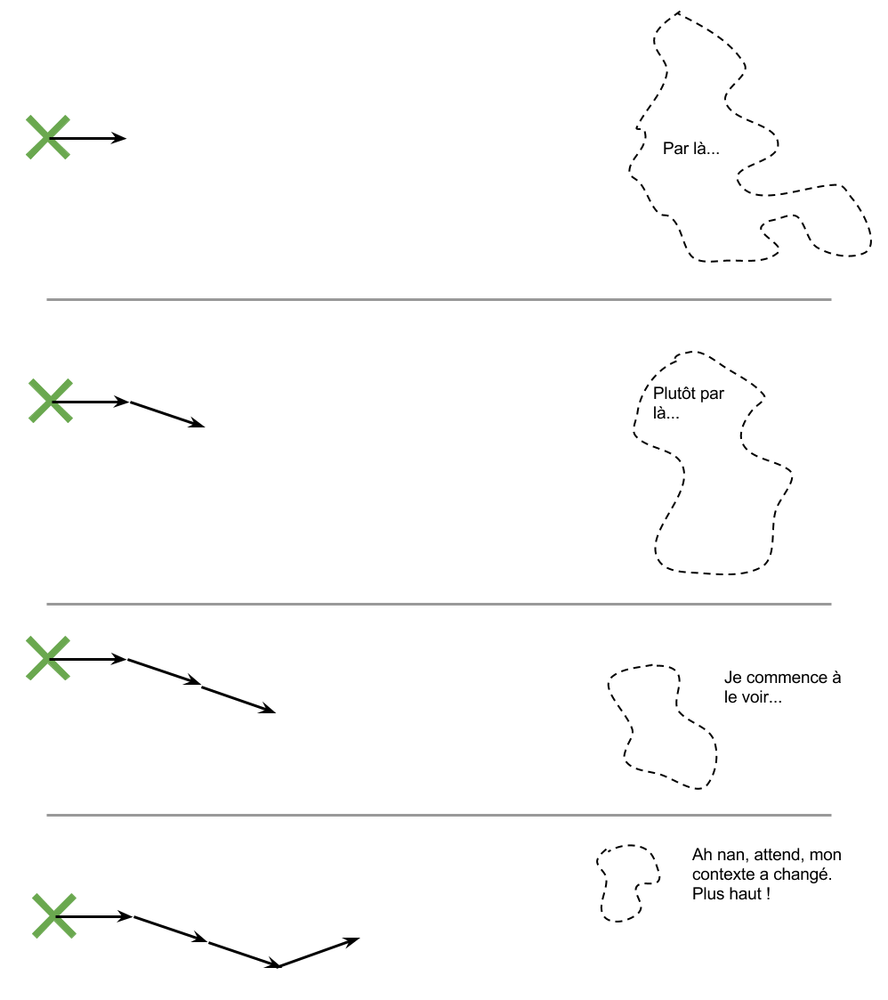

# Gestion de projet agile - des itérations

Une des composantes majeurs de dtc est d'accompagner les organisations avec/pour lesquelles nous travaillons. Cette idée d'accompagnement n'est pas seulement un positionnement dogmatique, mais une réponse très concrète à la complexité inherénte à faire des produits interactifs.

Dans cette page, nous expliquons une partie importante de notre façon de travailler : l'approche par itération avec rendus réguliers.

## La relation client-prestataire

On peut schématiser "l'imaginaire client" classique avec le schéma suivant :

On peut découper 3 éléments dans ce schéma : 
- le client sait où il en est
- le client sait où il veut aller
- le prestataire va prendre le chemin le plus rapide pour y arriver (la ligne droite)

Malheureusement, la réalité n'est jamais aussi simple. D'après nos expériences professionelles, respectives, nous pouvons battre en brêche les 3 pré-supposés : 

Même si c'est plutôt rare, il arrive le client ne connait pas bien son environnement, ne connait pas bien ses outils et/ou les personnes autour de lui/elle. Il/elle a déjà la réponse a son besoin sous la main, mais ne le voit pas. Pour la suite de cette page, nous présupposerons quand même que le client sait d'où il part.

Par contre, il est très fréquent que le client ne sache pas ce qu'il veut. Il/elle l'exprimera avec des mots vagues ou insuffisamment précis pour commencer à construire avec confiance. Il est aussi extrêmement fréquent que le besoin du client évolue au cours du temps. Les priorités changent parfois. Ou, au contact de premiers rendus, le client se rend compte que la direction n'est pas la bonne. Ces facteurs sont inévitables. 

Enfin, la pratique de transformer une idée en un produit apporte son lot de surprises (difficulté technique métier ou opérationelle imprévue, etc.) et la ligne droite a peut-être un mur au milieu qu'il faudra bien contourner, mais on ne le sait jamais tant qu'on n'est pas arrivé devant le mur.

## A l'ancienne

Ils sont incomptables les projets qui se sont planifiés comme des lignes droites où on laisse le prestataire avec un cahier des charges et on le retrouve 6 mois ou 2 ans plus tard. Le fameux [effet tunnuel](http://christian.hohmann.free.fr/index.php/lean-en-conception-et-developpement/les-basiques-du-lean-en-conception-et-developpement/286-panique-en-developpement-effet-tunnel) On arrive toujours au même résultat :

Il existe [d'autres images](http://www.tamingdata.com/wp-content/uploads/2010/07/tree-swing-project-management-large.png) sur le sujet.

Le budget du client est consommé, le produit n'est pas celui qu'il attendait et arrivent les conflits de toute sorte dont la conclusion la plus commune est que le client rajoute du budget pour couvrir le dernier delta.

## Par itérations

Nous acceptons un présupposé différent qui ressemble plutôt à ça :

Vous savez seulement vaguement où vous voulez. Pas grave. On va travailler ensemble à deux tâches simultanément :
- rafiner le besoin
- construire un produit progressivement qui va dans la-bonne-direction-pour-l'instant

Et ça va ressembler à ça :

Cette méthode a plusieurs avantages :
- Vous savez de mieux en mieux ce que vous voulez
- A la fin de chaque itérations (2-3 semaines), vous avez un produit qui se rapproche de plus en plus de ce que vous voulez. Vous pouvez arrêter le développement quand vous voulez d'ailleurs.
- Votre budget est optimisé : durant chaque itération, on avance le produit au mieux du niveau de connaissance que l'on a à ce moment-là.

Travailons ensemble intelligemment :-)
